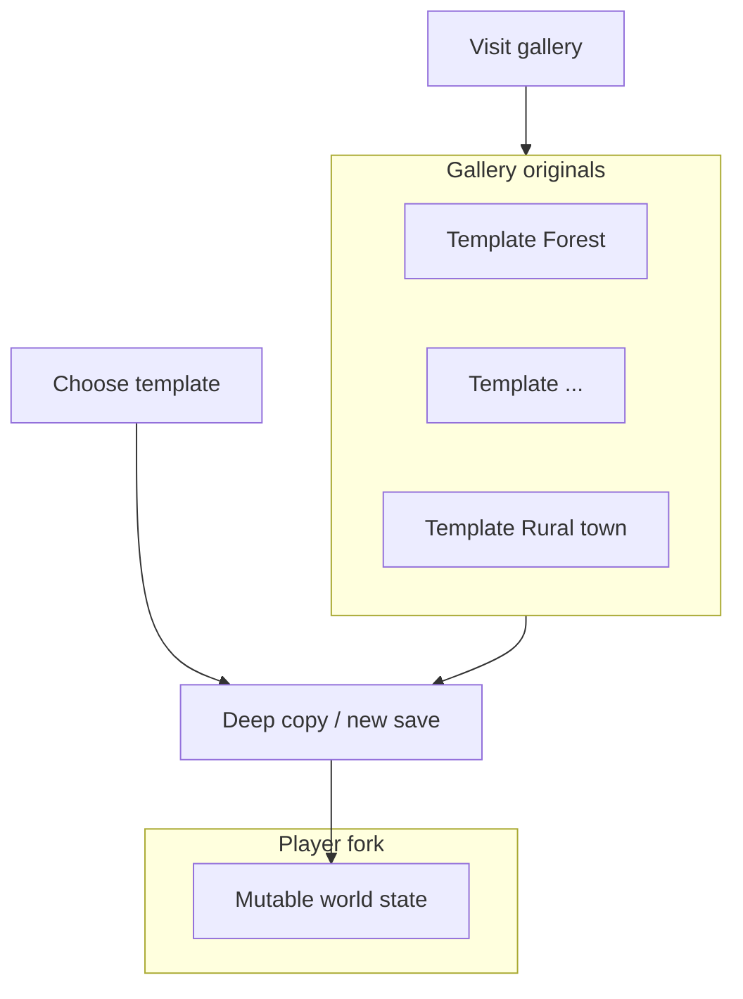
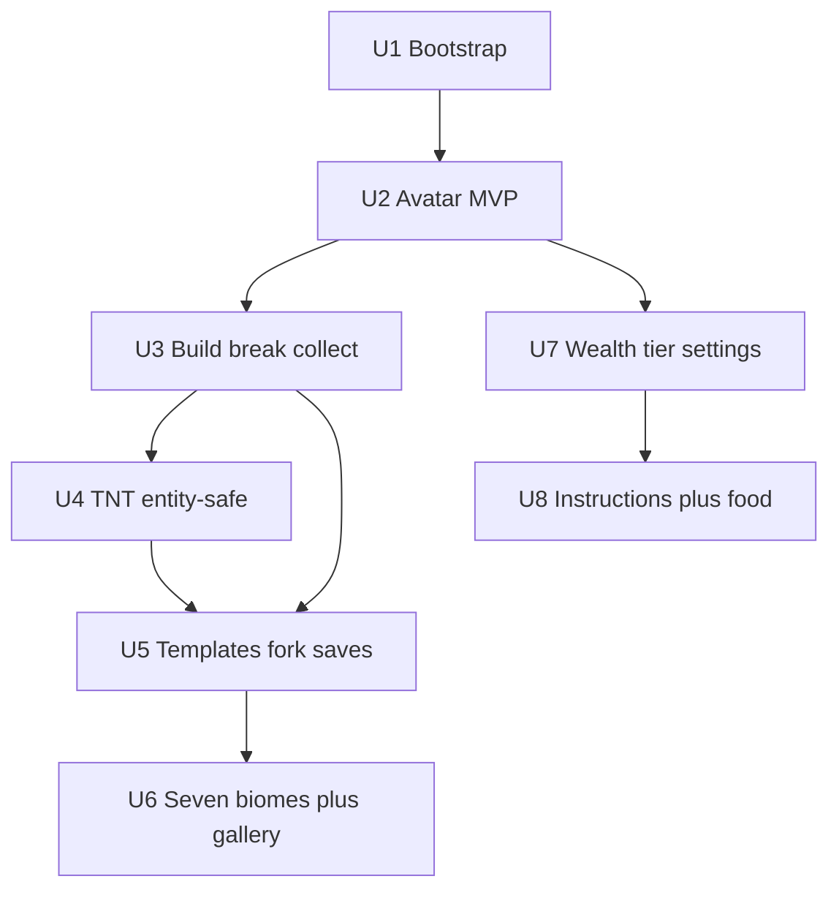

# LEGO-like sandbox — vertical slice and systems foundation

## Overview

Deliver a **playable solo vertical slice** of a calm **creative sandbox**: **forked worlds** from **seven premade biome templates**, **non-lethal destruction** (including **TNT**), **piece collection**, **optional food buffs**, **wealth tier** with **settings changes that never wipe progress**, and an **in-game instruction storefront** gated by tier. The repository currently contains only `README.md` and the origin requirements doc — implementation **selects an engine and folder layout** as part of U1.

---

## Problem Frame

Players need a **creative LEGO-like** experience: **explore pristine showcase worlds**, **start new saves from a chosen template**, **build and break** without **killing**, and **optionally buy build guidance** — with **explosions affecting only destructible environment**, not **avatars or animals** (see origin: `docs/brainstorms/lego-creative-worlds-game-requirements.md`).

---

## Requirements Trace

| Req | Summary | Implementation units |
|-----|-----------|----------------------|
| R1 | Seven premade showcase worlds | U6 |
| R2 | New game forks from chosen template | U5, U6 |
| R3 | Originals pristine, gallery replay | U5, U6 |
| R4 | No killing | U4 (no lethal pipeline); creature behavior out of combat scope |
| R5 | Player may break blocks / environment | U3 |
| R6 | TNT affects blocks only, not player/creatures | U4 |
| R7 | Food = optional perks only | U8 |
| R8 | Collect pieces | U3 |
| R9 | Purchasable instructions; tier affects storefront | U8, U7 |
| R10 | Wealth tier at creation | U7 |
| R11 | Tier changeable in settings; retain earned content | U7, U8 |
| R12 | Solo first | U1–U8 scope (no net code) |
| R13 | Character creation beyond starter | U2 (MVP look + hooks); full creator deferred |
| R14 | Default red shirt, blue pants, dot eyes, soft smile | U2 |

---

## Scope Boundaries

- **In scope (this plan):** First **playable loop** in **solo** mode; **one engine/toolchain** chosen and documented; **data model** for templates vs forked saves; **vertical slice** proving **fork + TNT + entity safety**.
- **Non-goals:** Shipping **multiplayer**, **mobile/console certification**, **monetization/real money**, **full character creator** (only **starter look + hook** for later customization).
- **Deferred to follow-up work:** **Networking**, voice chat, **narrative campaign**, **full art pass** on all seven biomes (first milestone may ship **greybox** biomes with correct **labels** and **fork** behavior).

---

## Context & Research

### Relevant code and patterns

- **None yet** — repository is greenfield (`README.md` only). All paths below are **proposed** layout after U1.

### Institutional learnings

- No `docs/solutions/` entries in this repo.

### External references

- Godot Engine **4.x** documentation (if Godot is chosen): scenes, resources, **CharacterBody3D**, **Area3D** damage filtering — consult during U2–U4.
- Patterns for **non-destructive template scenes**: instantiate **copy** for forked save; keep **read-only source** scenes for gallery.

**Research decision:** Local patterns are **absent**; the plan assumes **Godot 4.x** as the default stack for a solo-friendly open-source pipeline. **Unity** remains a valid alternative if the team standardizes on it — U1 must **record the final choice** in `README.md` (and optional `docs/tech-stack.md`).

---

## Key Technical Decisions

| Decision | Rationale |
|----------|-----------|
| **Default engine: Godot 4.x** | Small repo footprint, strong scene instantiation model for **template → fork**, script-friendly for rapid iteration. |
| **Fork = deep copy of world state** | Satisfies R2/R3: edits never mutate **canonical** template scenes on disk; gallery loads **immutable** template or a **read-only instance**. |
| **Explosions use layered damage** | Only **voxel/block layer** (or destructible props on a **Blocks** collision layer) receives blast damage; **Player** and **Creatures** layers excluded (R6). |
| **Instruction tier rules (planning assumption)** | Each instruction defines **`min_wealth_tier`** and optional **`requires_progression_flag`**. Purchase allowed if `(tier ≥ min)` OR `flag` set; **owned instructions never removed** on tier downgrade (R11). Exact catalog content stays **data-driven** (`resources/instructions/*.tres` or JSON). |
| **Food** | **Buff components** on player with **timed duration**; **no** hunger stat (R7). |

---

## Open Questions

### Resolved during planning

- **Which instructions each tier can buy first-run:** Use **`min_wealth_tier`** + optional **progression flags**; designers tune JSON/tres data without code changes.
- **Creature immunity:** **Explicit collision/mask** and **no damage hooks** on entities from explosive **Area3D** — document in U4 verification.

### Deferred to implementation

- Final **camera feel** (first vs third person), **exact block size**, **performance** of large voxel edits — tune after first playable.
- **Save file format** details (binary vs JSON snapshot) — choose during U5 based on prototype size.

---

## High-Level Technical Design

> *This illustrates the intended approach and is directional guidance for review, not implementation specification. The implementing agent should treat it as context, not code to reproduce.*

**Destruction pipeline (conceptual):** **Explosive** queries **block/prop colliders** in radius → removes or damages voxels; **same query skips** **CharacterBody** nodes tagged **Player** or **Creature**.

---

## Implementation unit dependency graph

---

## Implementation Units

- [ ] U1. **Engine bootstrap and repository layout**

**Goal:** Choose engine (**default Godot 4.x**), establish **project skeleton**, **run instructions**, and **contribution** pointers.

**Requirements:** Foundation for R12 solo delivery; enables all subsequent units.

**Dependencies:** None.

**Files:**
- Create: `README.md` (expand from stub: prerequisites, run, test command)
- Create: `docs/tech-stack.md` (engine version, rationale, alternatives considered)
- Create: engine project root per choice — e.g. `project.godot`, `scenes/`, `scripts/`, `worlds/templates/`, `resources/` (exact names follow engine conventions)

**Approach:**
- Lock **Godot 4.x** unless team overrides; initialize version-controlled project **without** committing `.godot/` cache if `.gitignore` added.
- Document **how to open and run** the game.

**Patterns to follow:** Standard layout for chosen engine’s official “first 3D game” or equivalent starter.

**Test scenarios:**
- **Happy path:** Clone repo, follow README, **game window launches** without errors.
- **Edge case:** Missing engine binary shows **clear** README prerequisite step.

**Verification:** A new developer can run the **empty or placeholder scene** from docs alone.

---

- [ ] U2. **Player avatar MVP and default look**

**Goal:** Controllable **solo** avatar with **starter appearance** matching R14; **camera** and **basic interaction ray** for later build tools.

**Requirements:** R12, R13, R14.

**Dependencies:** U1.

**Files:**
- Create: `scenes/player/player.tscn` (or equivalent)
- Create: `scripts/player/player_controller.gd` (or `.cs`)
- Create: placeholder mesh/materials for **red shirt**, **blue pants**, **dot eyes**, **soft smile** (procedural or simple meshes acceptable for slice)

**Approach:**
- **CharacterBody3D**-style movement; grounded camera.
- Document **where customization** will attach later (material slots / mesh swap hooks).

**Patterns to follow:** Engine’s recommended character controller pattern.

**Test scenarios:**
- **Happy path:** Move in empty test arena; avatar visible with **correct color regions** approximating R14.
- **Edge case:** Rapid direction changes remain stable (no fall-through floor in test scene).

**Verification:** Play scene shows **default look** and responsive controls.

---

- [ ] U3. **Placement, breaking, and piece collection**

**Goal:** **Place and remove** blocks; **collect** piece types into **inventory** (minimal UI or debug overlay).

**Requirements:** R5, R8.

**Dependencies:** U2.

**Files:**
- Create: `scripts/world/block_world.gd` (or modular voxel manager)
- Create: `scripts/systems/inventory.gd`
- Create: `tests/` or engine-native test hooks for inventory rules

**Approach:**
- Represent world as **chunked grid** or **finite plate** for slice; **pick ray** from player for aim.
- **Breaking** drops **piece pickups** or increments counts; **collection** persists in save-ready structure later.

**Patterns to follow:** Single authority for **mutating** voxel state (avoid duplicate grids).

**Test scenarios:**
- **Happy path:** Place block, break block, **collection count increases**.
- **Edge case:** Break empty air → no-op; place out of bounds → rejected or clamped.
- **Integration:** Inventory mutation flows through **one API** used by future save/load.

**Verification:** Debug overlay shows **inventory tallies** changing with **place/break**.

---

- [ ] U4. **Explosives and entity-safe damage**

**Goal:** **TNT** (or placeholder bomb) **destroys/removes blocks** in radius; **player** and **creature** bodies **take no damage** from explosion.

**Requirements:** R4, R6.

**Dependencies:** U3.

**Files:**
- Create: `scenes/effects/tnt.tscn`, `scripts/effects/tnt.gd`
- Create: `scenes/creatures/test_creature.tscn` + minimal wander or idle AI **optional** for demo

**Approach:**
- Implement blast as **spatial query** filtered to **destructible** layers/tags only.
- **Explicitly exclude** nodes in groups **`player`**, **`creature`**, or layers configured as non-voxel.

**Patterns to follow:** Central **damage dispatcher** only for environment if multiple explosive types appear later.

**Test scenarios:**
- **Happy path:** TNT removes blocks in radius; **player HP/state unchanged** (or no HP system yet — **position unchanged** / **no hurt state**).
- **Happy path:** Creature within blast radius **unchanged** (still alive, same behavior).
- **Edge case:** TNT in empty air → **no crash**; zero blocks in radius → **no-op**.
- **Integration:** Explosion pipeline **does not** call **character damage** APIs.

**Verification:** Manual test scenario checklist in PR description or `docs/verification/tnt-entity-safety.md` with screenshots optional.

---

- [ ] U5. **Template scenes, forked saves, and slot model**

**Goal:** **Data model** and runtime flow: **create new game** = **copy template world state** into a **save slot**; **gallery** loads **non-mutating** template experience.

**Requirements:** R2, R3.

**Dependencies:** U3, U4 (fork must include destructive rules validated).

**Files:**
- Create: `scripts/systems/save_manager.gd` (or equivalent)
- Create: `worlds/templates/*.tscn` or serialized **snapshots** per template ID
- Create: `tests/test_fork_preserves_original.py` or GDScript tests if harness exists

**Approach:**
- **Canonical templates** live under **read-only** resource paths; **fork** copies **serialized voxel/inventory** into `user://saves/<slot>/`.
- **Opening gallery** never writes to template paths; optional **hash check** in dev builds.

**Patterns to follow:** Single **SaveManager** API for **new game**, **load**, **autosave**.

**Test scenarios:**
- **Happy path:** New game from template A → modify world → **template asset unchanged** on disk.
- **Happy path:** Gallery visit → exit → template still **pristine** when starting **another** new game from same template.
- **Edge case:** Corrupt save slot → **graceful error** and return to menu.

**Verification:** Delete player save folder and confirm **template resources** in repo **unchanged** by diff.

---

- [ ] U6. **Seven biome templates and gallery menu**

**Goal:** **Seven** labeled worlds — **forest, underwater, mountains, desert, cave, city, rural town** — each loadable as **template** and **gallery**; **UI** to pick template for **new game** and **visit gallery**.

**Requirements:** R1, R2, R3.

**Dependencies:** U5.

**Files:**
- Create: seven template scene or data files under `worlds/templates/` (greybox acceptable)
- Create: `scenes/ui/main_menu.tscn`, `scripts/ui/world_picker.gd`

**Approach:**
- Even **minimal** terrain differentiation per biome (flat colored planes + label) is acceptable for **first milestone** if **fork + gallery** behavior is correct; **art pass** deferred.

**Patterns to follow:** **Enum** or string IDs for `BiomeId` shared by UI and save metadata.

**Test scenarios:**
- **Happy path:** Each biome appears in **picker**; **new game** creates fork from selected ID.
- **Happy path:** **Gallery** visits each of seven without mutating templates (reuse U5 checks).
- **Edge case:** Unknown biome ID in old save → **fallback** or migration message.

**Verification:** Checklist of **7/7** biomes selectable and loadable.

---

- [ ] U7. **Wealth tier and settings**

**Goal:** **Poor / average / rich** at **character creation** and **settings** menu; changing tier **does not remove** inventory or purchased instructions; **future** purchases use new tier rules.

**Requirements:** R10, R11.

**Dependencies:** U2 (player profile hook).

**Files:**
- Create: `scripts/systems/player_profile.gd` (wealth tier, cosmetic flags)
- Create: `scenes/ui/settings.tscn`

**Approach:**
- Persist **tier** in save metadata and **settings** file.
- **Shop filtering** (U8) reads **current tier**; **owned instruction IDs** stored separately and **never deleted** on tier change.

**Patterns to follow:** **Immutable event** or signal when tier changes so UI refreshes.

**Test scenarios:**
- **Happy path:** Change tier **poor → rich**; **existing inventory and owned instructions** unchanged.
- **Edge case:** Tier change mid-session updates **shop visibility** for **not-yet-owned** items only.

**Verification:** Scripted or manual **tier flip** with counts logged before/after.

---

- [ ] U8. **Instruction storefront and food buffs**

**Goal:** **Buy instructions** with **in-game currency** (stub earn loop: e.g. break blocks grant **studs**); **tier-gated** catalog per planning assumptions; **food** grants **timed perks** only.

**Requirements:** R7, R9, R11.

**Dependencies:** U3 (currency earn), U7 (tier + ownership).

**Files:**
- Create: `resources/instructions/catalog.json` (or `.tres` list)
- Create: `scripts/systems/shop.gd`, `scripts/systems/currency.gd`
- Create: `scripts/systems/food_buffs.gd`
- Create: `scenes/ui/shop_ui.tscn`, `tests/test_shop_tier_rules.gd` or equivalent

**Approach:**
- **Catalog entries:** `id`, `price`, `min_wealth_tier`, optional `requires_flag`.
- **Instruction unlock** shows **ghost blueprint** or **step list UI** — minimal for slice (e.g. modal with steps).
- **Food:** consumable items apply **speed_multiplier**, **build_speed_bonus**, etc., with **timer**; **no** hunger decay.

**Patterns to follow:** Single **Purchase** function checks tier + currency + duplicates.

**Test scenarios:**
- **Happy path:** Sufficient currency + tier → purchase adds **owned id**; appears in **library**.
- **Edge case:** Insufficient tier → item **hidden or disabled** per UX choice (document which).
- **Edge case:** Duplicate purchase → **rejected** with message.
- **Happy path:** Eat food → **buff active** → expires → **reverts**.
- **Integration:** Tier downgrade does **not** remove **owned** instruction IDs from library.

**Verification:** Demo script: earn currency, buy one instruction, flip tier, confirm **ownership** persisted.

---

## System-Wide Impact

- **Interaction graph:** **SaveManager** ↔ **World** ↔ **Shop** ↔ **Player profile**; explosions only touch **voxel system**.
- **Error propagation:** Save/load failures must **surface in UI**, not silent corruption.
- **State lifecycle:** **Fork** must complete before player edits **autosave** path.
- **Unchanged invariants:** **Template assets** on disk remain **read-only** from gameplay code paths.

---

## Risks & Dependencies

| Risk | Mitigation |
|------|------------|
| **Voxel + physics performance** | Start **small** chunks; profile early in U3. |
| **Accidental template mutation** | Code review **SaveManager** paths; add **dev-only** assert that template paths are never opened for write. |
| **Explosion hurts entities via edge case** | Automated or checklist verification in U4; **group/layer** convention documented. |
| **Scope creep (full LEGO fidelity)** | Ship **greybox** biomes in U6; **defer** art until loop is fun. |

---

## Documentation / Operational Notes

- Update **`README.md`** after U1 with **engine version** and **run** steps.
- Optional **`docs/verification/`** for **TNT entity safety** checklist if team wants repeatable QA.

---

## Sources & References

- **Origin document:** [docs/brainstorms/lego-creative-worlds-game-requirements.md](docs/brainstorms/lego-creative-worlds-game-requirements.md)
- **Engine:** Godot 4.x (default assumption — confirm in U1)
