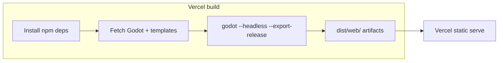
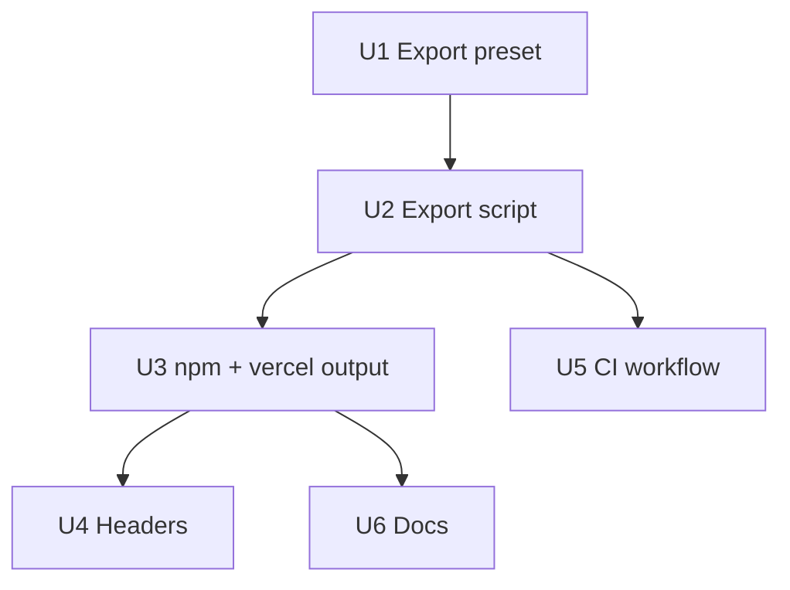

# Godot Web export + Vercel deploy pipeline

## Overview

Ship the **playable Godot game** on **Vercel** by replacing the stub **`public/`** landing-only deploy with a **build that runs `godot --headless --export-release`** and publishes the **generated Web export folder** as the deployment root (see origin: `docs/ideation/2026-05-02-godot-web-export-ideation.md`). **Vercel’s build** installs/links **Godot + matching export templates**, exports to a deterministic directory (e.g. `dist/web/`), and sets **`outputDirectory`** to that folder.

---

## Problem Frame

The site currently builds **`public/index.html`** via `npm run build` (`scripts/vercel-build.js`) and never produces **`.wasm` / `.pck`**. Players need the **HTML5 export** artifacts so the **same GDScript project** runs in the browser on the production URL.

---

## Requirements Trace

| ID | Requirement |
|----|-------------|
| R1 | **Headless export** runs in **Vercel build** (or documented equivalent) without a GUI. |
| R2 | **Export preset** is **named consistently** for CLI (`--export-release "<PresetName>"`). |
| R3 | **Godot version** matches **export templates** (same minor/patch as documented). |
| R4 | **Output directory** contains Godot’s **`index.html`** and sibling assets at URLs Vercel serves. |
| R5 | **`vercel.json`** declares **`buildCommand`**, **`outputDirectory`**, and **correct headers/MIME** for `.wasm` (and threading policy documented). |
| R6 | **Contributors** can reproduce export locally or via CI logs. |

---

## Scope Boundaries

- **In scope:** Export preset committed as **`export_presets.cfg`**, build script(s), **`package.json`** / **`vercel.json`** updates, optional **GitHub Actions** verification workflow, **`README.md`** / **`docs/tech-stack.md`** updates.
- **Non-goals:** Rewriting gameplay for web; **PWA / offline** polish unless trivial in preset; **mobile Safari** certification beyond documenting smoke-test expectation.
- **Deferred to follow-up work:** **Custom HTML shell** with branded loader; **Brotli** precompression at build time; **split** landing site vs game under separate paths if marketing needs both.

---

## Context & Research

### Relevant code and patterns

- `project.godot` — Godot **4.3** feature tag; main scene `scenes/ui/main_menu.tscn`.
- `package.json` — `build` → `scripts/vercel-build.js` (stub validator today).
- `vercel.json` — `outputDirectory: public`, `buildCommand: npm run build`.
- `public/index.html` — static stub; will be **superseded or relocated** once Web export is the deploy root (decision in U3).

### Institutional learnings

- None in `docs/solutions/`.

### External references

- Godot stable docs: [Exporting for the Web](https://docs.godotengine.org/en/stable/tutorials/export/exporting_for_web.html) — **Compatibility** renderer for web, **single-threaded** default recommended, CLI export pattern, **MIME** / compression notes.

---

## Key Technical Decisions

| Decision | Rationale |
|----------|-----------|
| **Single-threaded Web preset by default** | Avoids **SharedArrayBuffer** + **COOP/COEP** unless you explicitly enable threads later. |
| **Preset name** e.g. `Web` | Must match **`godot --export-release "Web"`** exactly. |
| **Output dir `dist/web/`** | Keeps generated assets out of `public/`; Vercel **`outputDirectory`** points here after build. |
| **Godot fetched in build** | Vercel build image has no Godot; download **official** Linux editor binary + templates version pinned in **`scripts/godot-version.env`** (or `package.json` `config`). |
| **Landing stub** | Either **drop** stub as sole homepage (game `index.html` at `/`) or **copy** `public/index.html` → `dist/web/landing.html`** pre-export — pick one in U3 so routes stay predictable. |

---

## Open Questions

### Resolved during planning

- **Zip vs directory export:** Prefer exporting **`index.html`** into **`dist/web/`** directly (avoid known CLI zip pitfalls on some versions).
- **Threads:** Start **off**; add COOP/COEP in `vercel.json` only when enabling thread support.

### Deferred to implementation

- Exact **download URL** pattern for Godot **4.3.x** Linux zip (verify current archive layout on godotengine.org).
- Whether **total artifact size** exceeds **Vercel** limits — monitor first deploy; fallback **external host** for `.pck` only if needed.

---

## High-Level Technical Design

> *Directional guidance for review, not implementation specification.*

---

## Implementation unit dependency graph

---

## Implementation Units

- [x] U1. **Commit Web export preset (`export_presets.cfg`)**

**Goal:** Version-controlled export definition so CLI and editor agree.

**Requirements:** R2, R3, R6.

**Dependencies:** None.

**Files:**
- Create or modify: `export_presets.cfg` (via Godot Editor **Project → Export**, then commit)
- Modify: `docs/tech-stack.md` — pin **Godot version** and template requirement
- Modify: `README.md` — “Exporting for Web” bullets for contributors

**Approach:**
- In Godot **4.3+**, add **Web** preset; set **Compatibility** for renderer on web export; **disable thread support** initially; export path placeholder pointing at `dist/web/index.html` or relative path the CLI will use.
- Document: editors must install **export templates** matching engine version (`Editor → Manage Export Templates`).

**Patterns to follow:** Existing `docs/tech-stack.md` tone.

**Test scenarios:**
- **Happy path:** Opening the project in Godot shows **Web** preset with no errors in Export dialog.
- **Edge case:** Preset name documented — CLI uses identical string.

**Verification:** `export_presets.cfg` present in repo; export dialog opens without missing-template errors on a clean machine with templates installed.

---

- [x] U2. **Headless export script (Godot download + `godot --export-release`)**

**Goal:** One script used locally and by Vercel to populate **`dist/web/`**.

**Requirements:** R1, R3.

**Dependencies:** U1.

**Files:**
- Create: `scripts/godot-version.env` (or inline version in `scripts/export-web.sh`) — **`GODOT_VERSION=4.3.x`**
- Create: `scripts/export-web.sh` — idempotent: ensure Godot binary + templates, mkdir `dist/web`, run headless export
- Create: `tests/export_web_smoke.gd` *(optional)* — only if useful for `godot --headless -s` sanity; else defer

**Approach:**
- Download **Linux x86_64** Godot **matching** pinned version (CI/Vercel runs Linux).
- Install/export templates via documented Godot CLI flags **or** unpack template TPZ into expected user path — follow official headless export docs for **4.3**.
- Run: `godot --headless --path . --export-release "Web" dist/web/index.html` (adjust path to match preset).

**Patterns to follow:** Keep secrets out of scripts; use `set -euo pipefail` in bash.

**Test scenarios:**
- **Happy path:** On Linux or Darwin with script adapted, `dist/web/` contains `index.html` and `.wasm`/`.pck` after run.
- **Error path:** Wrong version → script exits non-zero with clear message.
- **Integration:** Artifact filenames match what HTML expects (same basename).

**Verification:** Local or Docker run produces a loadable folder via `python -m http.server` smoke test.

---

- [x] U3. **`npm run build` orchestration + Vercel `outputDirectory`**

**Goal:** `npm run build` performs Web export and sets deploy root to **`dist/web`**.

**Requirements:** R4, R5.

**Dependencies:** U2.

**Files:**
- Modify: `package.json` — `build` runs Node wrapper **or** `bash scripts/export-web.sh`
- Modify: `scripts/vercel-build.js` — replace stub: invoke export script, verify **`dist/web/index.html`** exists
- Modify: `vercel.json` — `"outputDirectory": "dist/web"` (or `"dist/web"` per Vercel schema), ensure **`installCommand`** allows bash (default npm install + script uses bash)
- Delete or relocate: `public/index.html` if superseded — **or** copy into `dist/web/` as secondary page (document chosen UX)

**Approach:**
- **Default:** Production URL serves **Godot `index.html` at `/`** — simplest mental model for “game runs on Vercel.”
- If retaining marketing copy: copy stub to **`dist/web/landing.html`** and add link from Godot custom HTML later **(defer)** or keep **`public/`** only in repo for dev reference.

**Patterns to follow:** Existing `vercel.json` JSON shape.

**Test scenarios:**
- **Happy path:** After build, `dist/web/index.html` exists and references existing `.wasm`/`.pck` paths.
- **Edge case:** Build fails fast if Godot export fails (non-zero exit).

**Verification:** `npm run build` exits 0 locally/CI when Godot fetch succeeds.

---

- [x] U4. **`vercel.json` HTTP headers for WebAssembly**

**Goal:** Serve **`.wasm`** with **`application/wasm`**; document **COOP/COEP** only if threads enabled.

**Requirements:** R5.

**Dependencies:** U3.

**Files:**
- Modify: `vercel.json` — add `headers` array for `*.wasm` and optionally `*.pck`

**Approach:**
- Add header rules per [Vercel headers](https://vercel.com/docs/project-configuration/headers).
- **Do not** add COOP/COEP until thread export is intentionally enabled.

**Test scenarios:**
- **Happy path:** Response headers for `.wasm` include correct `Content-Type` in Vercel preview (manual check DevTools).

**Verification:** Document checklist in `README` for post-deploy verification.

---

- [x] U5. **GitHub Actions workflow (optional verify)**

**Goal:** PRs validate that export **still builds** on Linux.

**Requirements:** R6.

**Dependencies:** U2.

**Files:**
- Create: `.github/workflows/godot-web-export.yml`

**Approach:**
- Trigger on `pull_request` paths: `project.godot`, `export_presets.cfg`, `scripts/**`, `scenes/**`, `scripts/**/*.gd`, etc.
- Run same export script as Vercel; **upload `dist/web`** as artifact for debugging (optional).

**Test scenarios:**
- **Happy path:** Green workflow when export succeeds.
- **Failure:** Workflow fails if `dist/web/index.html` missing after build.

**Verification:** PR shows passing check.

---

- [x] U6. **Documentation pass**

**Goal:** Operators know version pins, URL limits, and Safari caveats.

**Requirements:** R6.

**Dependencies:** U3, U4.

**Files:**
- Modify: `README.md` — Vercel **Build & Output** settings; environment vars if any
- Modify: `docs/tech-stack.md` — Web export subsection

**Approach:**
- Link Godot web troubleshooting (Safari WebGL2, mobile thermal limits) briefly.

**Test scenarios:**
- **Test expectation:** none — documentation only.

**Verification:** New contributor can follow README to understand deploy shape.

---

## System-Wide Impact

- **Vercel:** Build time increases (Godot download + export); possible **bandwidth/size** limits — watch first deploy logs.
- **Game runtime:** `user://` persistence uses **IndexedDB** on web — existing saves may need QA (`SaveManager` / `PlayerProfile`).
- **Repo size:** `export_presets.cfg` small; **do not commit** `dist/web/` artifacts.

---

## Risks & Dependencies

| Risk | Mitigation |
|------|------------|
| Godot download URL / archive layout changes | Pin patch version; verify in CI when bumping |
| Export exceeds Vercel size/time limits | Monitor; shrink assets or split hosting |
| Safari / WebGL2 issues | Document Chrome-first QA; single-thread preset |

---

## Documentation / Operational Notes

- Update **Vercel project settings** screenshot list in README: **Output Directory** = `dist/web`.
- Note **Godot license** / attribution if required by export template distribution terms.

---

## Sources & References

- **Origin ideation:** [docs/ideation/2026-05-02-godot-web-export-ideation.md](docs/ideation/2026-05-02-godot-web-export-ideation.md)
- **Existing deploy:** `vercel.json`, `package.json`, `scripts/vercel-build.js`, `public/index.html`
- **Godot docs:** [Exporting for the Web](https://docs.godotengine.org/en/stable/tutorials/export/exporting_for_web.html)
