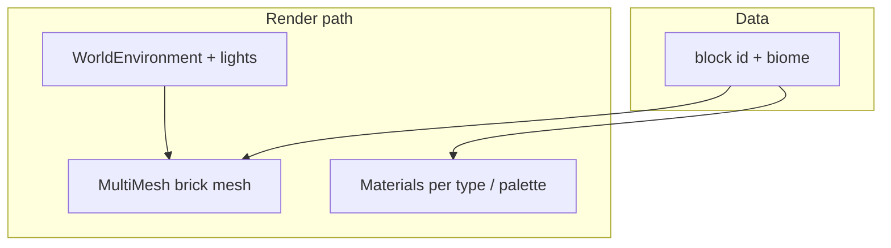
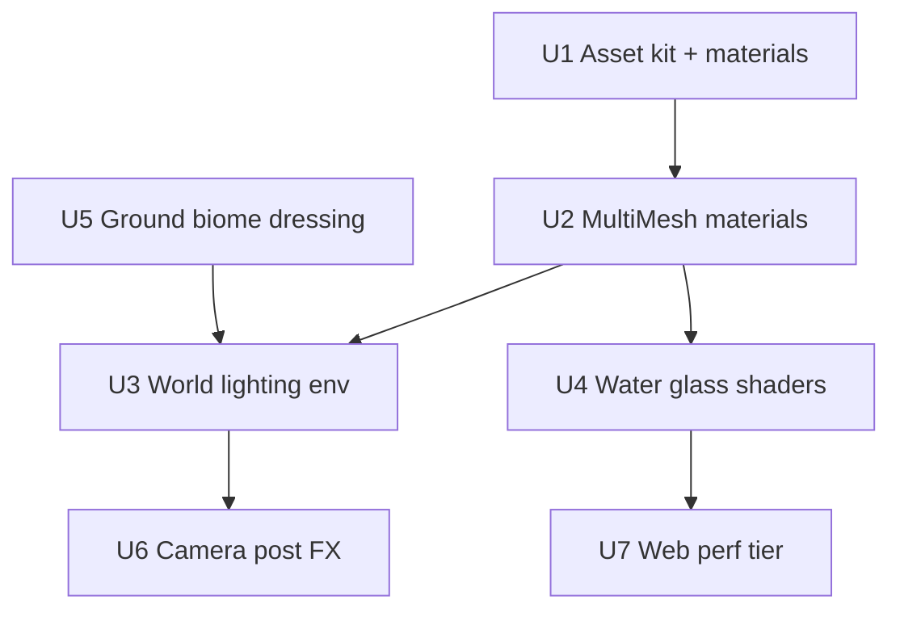

# Toy-brick diorama graphics upgrade

## Overview

Elevate visuals from **flat shaded cubes** to a **readable toy-brick diorama** aligned with the reference direction: **plastic LEGO-like bricks** (visible studs), **PBR-style materials**, **layered lighting** (sun + bounce/fill + localized glow), **ambient occlusion depth**, and **optional stylized water** — without breaking **solo sandbox** gameplay or **Web** builds (**Compatibility** / WebGL 2).

*(Origin alignment: calm creative sandbox, seven biomes, fork/gallery — cosmetic-only upgrade unless explicitly scoped.)*

---

## Problem Frame

`scripts/play_world.gd` builds terrain as a **`MultiMeshInstance3D`** with a **`BoxMesh`** and **one biome tint** via `material_override` — maximum instance throughput, minimum visual interest. Players perceive “debug blocks,” not a cohesive toy world (see user reference: diorama with studs, glossy water tiles, warm accent lights).

---

## Requirements Trace

| ID | Requirement |
|----|-------------|
| R1 | **Brick readability** — studs / bevels / material variation so blocks read as **toy plastic**, not generic voxels. |
| R2 | **Biome identity** — seven biomes remain distinguishable via **palette + props/lighting**, not only one flat hue. |
| R3 | **Lighting & depth** — directional + ambient fill; **SSAO or baked AO proxy** where Compatibility allows; localized glow for “treasure” moments (optional). |
| R4 | **Water / glass** — underwater (and glass-type blocks) use **stylized transparency/reflection** within Web-safe shader limits. |
| R5 | **Performance** — desktop-first quality with **tiered falloffs** (LOD, simpler shaders on web / low-end). |
| R6 | **No gameplay regression** — collision, TNT radius, inventory keyed by **logical block id** unchanged. |

---

## Scope Boundaries

- **In scope:** Materials, meshes, lighting, environment, camera polish, optional post-processing **supported on Compatibility**.
- **Non-goals:** Photorealism, third-party asset store licensing without attribution files, Forward+/Mobile-only features that **break web export**.
- **Deferred to follow-up work:** Full **custom brick sculptor**, **NPC/prop animation pipeline**, **dynamic weather**, **texture streaming** for huge worlds.

---

## Context & Research

### Relevant code and patterns

- `scripts/play_world.gd` — `_setup_multimesh`, `_rebuild_blocks_visual`, `_biome_base_color`.
- `scripts/world/block_world.gd` — integer block types (`% 3` today); may extend to **material id** without breaking saves if versioned.
- `scenes/play_world.tscn` — `StaticBody3D` ground plane, `DirectionalLight3D`, no `WorldEnvironment` yet.
- `export_presets.cfg` / docs — Web uses **Compatibility**; shader authors must verify **WebGL2** path.

### Institutional learnings

- None in `docs/solutions/`.

### External references

- Godot 4 **Compatibility** rendering for Web ([Exporting for the Web](https://docs.godotengine.org/en/stable/tutorials/export/exporting_for_web.html)).
- Godot **StandardMaterial3D** / ORM, **Mesh** stud geometry, **ShaderMaterial** for stylized water.

**Research note:** Proceeding without separate agent dispatch — local rendering stack is thin; risk is **Web shader parity**, called out per unit.

---

## Key Technical Decisions

| Decision | Rationale |
|----------|-----------|
| **Keep grid + MultiMesh** for bulk terrain | Preserves fill-rate performance; upgrade **mesh** + **per-instance or per-type materials** rather than thousands of `MeshInstance3D` nodes. |
| **Brick kit mesh** | Replace `BoxMesh` with **beveled brick + stud cylinders** (merged mesh or CSG bake once to `.glb` under `assets/meshes/`). |
| **Material palette per block type** | Map block id → `StandardMaterial3D` (roughness, metallic low, clearcoat optional) or **ShaderMaterial** variants shared by instance count. |
| **WorldEnvironment** | Add **ambient**, **tonemap**, **SSAO** (if enabled for Compatibility in target Godot version — verify); **glow** for small emissive accents. |
| **Web tier** | Feature tag `web` or runtime detect `OS.get_name()=="Web"` to disable SSAO / reduce shadow quality. |

---

## Open Questions

### Resolved during planning

- **Screenshot vs exact replica:** Plan targets **equivalent visual language** (diorama / toy / studs / mood light), not a single licensed asset pack.

### Deferred to implementation

- Whether **MultiMesh** can use **per-instance custom data** for tint without exceeding Web limits — prototype in U2.
- Exact **draw call budget** on mid-tier laptop + mobile web — profile after U4.

---

## High-Level Technical Design

> *Directional guidance for review, not implementation specification.*

---

## Implementation unit dependency graph

---

## Implementation Units

- [ ] U1. **Brick mesh kit + material library resources**

**Goal:** Author or import a **single merged brick mesh** (bevel + studs) and baseline **plastic PBR materials** (dirt, brick, glass, wood-tone, stone) as Godot resources.

**Requirements:** R1, R2.

**Dependencies:** None.

**Files:**
- Create: `assets/meshes/brick_unit.glb` (or `.tres` `ArrayMesh` export from Blender — document source)
- Create: `resources/materials/brick_*.tres` (`StandardMaterial3D` variants)
- Modify: `docs/tech-stack.md` — asset authoring note + CC/license if kit-based

**Approach:**
- Box mesh → **brick_unit** with **stud topology** on top face; scale matches `BlockWorld.CELL_SIZE`.
- Materials: moderate **roughness**, low **metallic**, subtle **normal** if available; **vertex colors** optional for cheap variation.

**Patterns to follow:** Keep paths under `assets/` / `resources/` per existing JSON/catalog layout.

**Test scenarios:**
- **Happy path:** Mesh imports in editor, no scale drift vs `1.0` cell.
- **Edge case:** Web export loads scene — no missing external deps.

**Verification:** Brick mesh assigned manually in a test scene looks toy-like under default sun.

---

- [ ] U2. **MultiMesh upgrade: mesh swap + per-type coloring**

**Goal:** Replace `BoxMesh` with **brick kit**; drive **albedo/tint** by block type id (and biome accent).

**Requirements:** R1, R2, R6.

**Dependencies:** U1.

**Files:**
- Modify: `scripts/play_world.gd`
- Modify: optional `scripts/world/block_world.gd` — document block id → visual mapping
- Create: `tests/` or manual checklist `docs/verification/graphics-web-smoke.md`

**Approach:**
- If **single material override** remains: use **`mesh`** from kit + **vertex colors** from script (if mesh supports) **or** split into **up to N MultiMeshInstance3D** per material batch (e.g. 3–5 draw calls per chunk vs 1).
- Preferred scalable pattern: **`multimesh.set_instance_custom_data`** (Godot 4.3+) packing RGB tint + type index in **shader** — verify Web export supports custom data path.

**Test scenarios:**
- **Happy path:** Place/break blocks — visuals update; counts unchanged.
- **Integration:** Save/load — block ids unchanged; only visuals differ.

**Verification:** Side-by-side screenshot vs old flat cubes shows studs + material separation.

---

- [ ] U3. **Lighting & WorldEnvironment**

**Goal:** Add **WorldEnvironment** (ambient, tonemap), tune **DirectionalLight3D** (shadow bias, soft shadows if affordable), optional **OmniLight3D** for warm accents in templates.

**Requirements:** R3.

**Dependencies:** U2.

**Files:**
- Modify: `scenes/play_world.tscn`
- Create: `resources/environment/toy_diorama_env.tres` (`Environment` resource)

**Approach:**
- **SDFGI off** (Compatibility); use **SSAO** if project settings allow on desktop — **disable on Web** via script or duplicate env resource.

**Test scenarios:**
- **Happy path:** Ground + bricks read with depth; no blown-out whites.
- **Edge case:** Gallery mode — lighting stable when switching biomes.

**Verification:** Visual inspection + FPS counter optional.

---

- [ ] U4. **Stylized water & glass blocks**

**Goal:** Block types that represent **glass** / **water** use **transparency + fresnel** shader; underwater biome gets **tinted fog-ish** feel via env or cheap shader uniform.

**Requirements:** R4, R5.

**Dependencies:** U2.

**Files:**
- Create: `resources/shaders/stylized_water.gdshader` (Compatibility-safe subset)
- Modify: `scripts/play_world.gd` — assign shader material for types mapped as water/glass

**Approach:**
- Avoid heavy screen-space refraction on Web — **planar-ish** or **cubemap fake** if needed.
- **Alpha blend** cost: limit transparent instance count or use **dither** on far chunks.

**Test scenarios:**
- **Happy path:** Glass reads glossy; water reads wet.
- **Performance:** Web build holds **≥ target FPS** on reference hardware (define in implementation).

**Verification:** Underwater template scene screenshot pass.

---

- [ ] U5. **Ground & biome dressing**

**Goal:** Replace flat **PlaneMesh** ground with **tiled brick/stone texture** or **instanced plate** matching toy scale; add **cheap props** (rocks, grass tufts) as **MultiMesh** or scene instances from `assets/props/`.

**Requirements:** R2.

**Dependencies:** U1, U3.

**Files:**
- Modify: `scenes/play_world.tscn`
- Create: `assets/props/` minimal meshes

**Approach:**
- Props **non-colliding** `StaticBody` optional — avoid physics regression.

**Test scenarios:**
- **Happy path:** Player walks without snagging; TNT still affects **block grid** only.

**Verification:** Each biome template “reads” different at first glance.

---

- [ ] U6. **Camera & post stack polish**

**Goal:** Optional **slightly elevated isometric** feel (adjust spring arm / FOV), mild **bloom** on emissives, **subtle vignette** — all toggled by quality tier.

**Requirements:** R3.

**Dependencies:** U3.

**Files:**
- Modify: `scripts/player/player_controller.gd` or `scenes/player/player.tscn`
- Modify: `resources/environment/toy_diorama_env.tres`

**Approach:**
- Respect **mouse look** — diorama skew is **camera offset**, not forced orthographic unless menu adds “showcase camera.”

**Test scenarios:**
- **Happy path:** Controls unchanged from README.
- **Edge case:** Esc / menu still usable.

**Verification:** Record short clip or screenshot set for PR.

---

- [ ] U7. **Quality tiers & Web fallbacks**

**Goal:** Central **GraphicsConfig** autoload or project settings: **Desktop**, **Web**, **Low** — disables SSAO, reduces shadow size, simplifies water shader.

**Requirements:** R5.

**Dependencies:** U3, U4, U6.

**Files:**
- Create: `scripts/autoload/graphics_config.gd` (optional)
- Modify: `project.godot` — document quality-related toggles
- Modify: `README.md` — “Graphics” section

**Test scenarios:**
- **Happy path:** `OS.get_name()=="Web"` picks reduced stack automatically.
- **Regression:** Desktop unchanged when tier is High.

**Verification:** Export web build; Chrome DevTools FPS acceptable.

---

## System-Wide Impact

- **Rendering:** More shader variants → watch **pipeline batching**; prefer shared materials.
- **Assets:** Repo size grows — consider **Git LFS** if `.glb` large (document).
- **Gameplay:** Collision still grid-aligned; **visual mesh larger than physics** risks perceived unfair TNT — keep **visual ≤ cell** or document fudge.

---

## Risks & Dependencies

| Risk | Mitigation |
|------|------------|
| Web shader limits | Test **every** custom shader on **HTML5 export** early (U4). |
| MultiMesh custom data limitations | Fallback to **few batched materials** (U2). |
| Art time / scope creep | Lock **MVP palette** (3–5 materials) before props burst (U5). |

---

## Documentation / Operational Notes

- Update **`README.md`** with screenshots and **quality tier** env vars.
- Add **`docs/verification/graphics-web-smoke.md`** checklist for releases.

---

## Sources & References

- **Origin:** User reference (toy-brick / LEGO-like diorama); product goals align with the game’s creative-sandbox brief (see repo brainstorm if present).
- **Rendering:** [Godot — Exporting for the Web](https://docs.godotengine.org/en/stable/tutorials/export/exporting_for_web.html)
- **Current visuals:** `scripts/play_world.gd`, `scenes/play_world.tscn`
